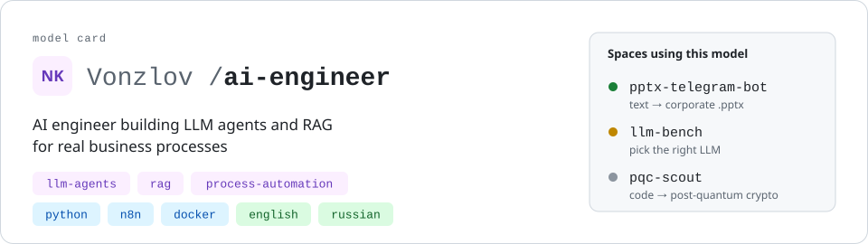

<picture>
  <source media="(prefers-color-scheme: dark)" srcset="assets/header-dark.svg">
  
</picture>

<b>English</b> · <a href="README_RU.md">Русский</a>

I build LLM-powered tools for real business processes, from assistants inside the software people already use to process automation, and Kubernetes infrastructure for running pipelines.

## Projects

### [Tellix](https://github.com/Vonzlov/Tellix) &nbsp; 

Kubernetes-native workflow engine for multi-step pipelines, ML included. Each step runs as its own Kubernetes Job in dependency order and passes its output files to the next steps; runs are stored in the cluster as a custom resource and driven by an operator.

**Stack:** Python, FastAPI, kopf, Kubernetes (CRD, Jobs, RBAC), Helm, SeaweedFS (S3), Docker, GitHub Actions, kind, pytest

### [pptx-telegram-bot](https://github.com/Vonzlov/pptx-telegram-bot) &nbsp; 

Telegram bot that turns plain text into a ready `.pptx` deck in a corporate template. Any template is plugged in through a YAML config, without code changes.

**Stack:** Python, aiogram, python-pptx, pydantic, Ollama (optional), Docker, pytest

### [llm-bench](https://github.com/Vonzlov/llm-bench) &nbsp; 

Benchmark service for choosing an LLM for a specific task: runs the same task set through local models and cloud APIs and compares the results.

**Stack:** Python, Ollama, vLLM, cloud LLM APIs, Docker, k3s, kind

### [pqc-scout](https://github.com/Vonzlov/pqc-scout) &nbsp; 

Assistant for migrating code to post-quantum cryptography: finds quantum-vulnerable algorithms in a codebase and helps plan their replacement.

**Stack:** Python, LLM

### Work projects (closed source)

**HR assistant in Outlook.** Three ribbon buttons: draft a reply to the selected email, revise a draft from the user's comments, summarise a whole thread. VBA on top of a corporate LLM API.

**Process automation.** n8n workflows that send project members digests of their tasks, and VBA macros for monthly bonus calculations and KPI maps.

### Smaller projects

**Vacancy matcher.** Telegram bot on n8n that collects vacancies from hh.ru and picks the ones that match my profile.

**Text-to-speech bot.** Telegram bot that voices text through a third-party TTS API.

## Stack

- **Languages:** Python, JavaScript, SQL, VBA
- **LLM:** OpenAI-compatible APIs, Ollama, vLLM, LLM agents, RAG, prompt engineering, LLM evaluation
- **Backend:** FastAPI, pydantic, aiogram, REST APIs, S3 (boto3), pytest
- **Infrastructure:** Kubernetes (CRD, operators), Helm, Docker, k3s, kind, GitHub Actions, Linux, Git
- **Automation:** n8n, Telegram bots, RPA (PIX), Bubble.io

## How I work

- **Code the whole team can own.** Solutions any engineer can read, extend and maintain from day one.
- **Reliability first.** A tool embedded in someone's workflow handles unexpected input gracefully: unknown items are skipped or flagged, and the run keeps going.
- **Measure, then choose.** I pick a model by testing it on the actual task, not by its reputation.

## Contact

<!-- TODO: подставить свои ссылки, лишнее удалить -->
[LinkedIn](https://www.linkedin.com/in/YOUR-HANDLE) · [Telegram](https://t.me/YOUR-HANDLE) · [Email](mailto:YOUR-EMAIL)
